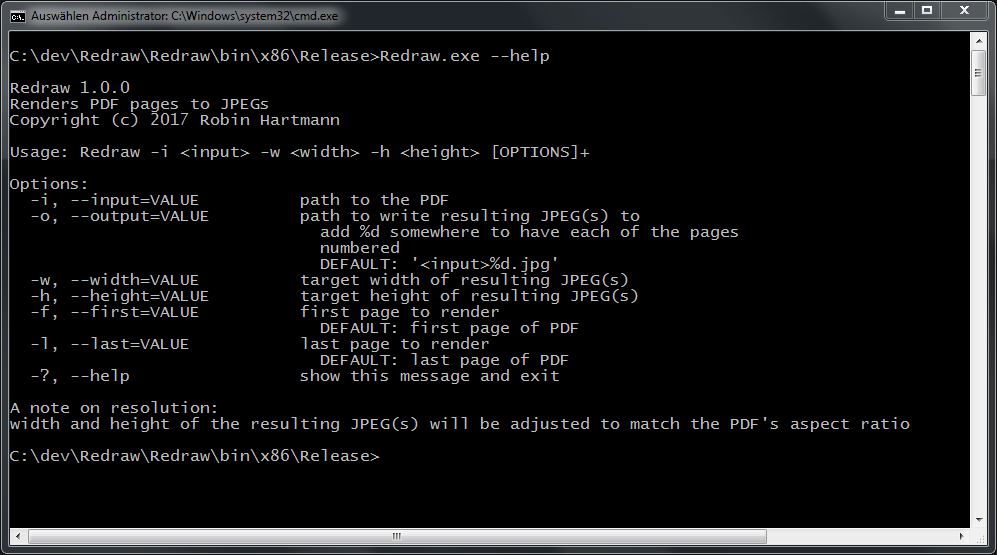

# 📰 Redraw

CLI app for rendering PDF pages to JPEGs

## ⚡ Deployment

These instructions will get you a release of this project up and running on your local machine, so that you can start using it.

### Prerequisites

* [Microsoft .NET Framework 4.0](https://www.microsoft.com/en-us/download/details.aspx?id=17718)

### Getting Started

Just copy over `gsdll32.dll` as well as `Redraw.exe` and run it. An installation is not needed.

## 🛠️ Development

These instructions will get you a copy of this project up and running on your local machine for development and testing purposes.

### Prerequisites

* [Visual Studio 2015/2017](https://www.visualstudio.com/de/vs/) - Fully-featured IDE for Android, iOS, Windows, web, & cloud

## 🧰 Built With

* [GhostscriptSharp](https://github.com/mephraim/ghostscriptsharp) - Simple C# wrapper for the Ghostscript library
* [NDesk.Options](http://www.ndesk.org/Options) - Callback-based program option parser
* [Costura](https://github.com/Fody/Costura) - Embeds dependencies as resources

## 👨‍💻 Authors

* **Robin Hartmann** - [robin-hartmann](https://github.com/robin-hartmann)

## 📃 License

This project is licensed under the MIT License - see the [LICENSE](LICENSE) file for details

## 👍 Acknowledgments

* Special thanks to [mobisys GmbH](https://github.com/mobisysgmbh) for letting me publish this project and being a great place to work
